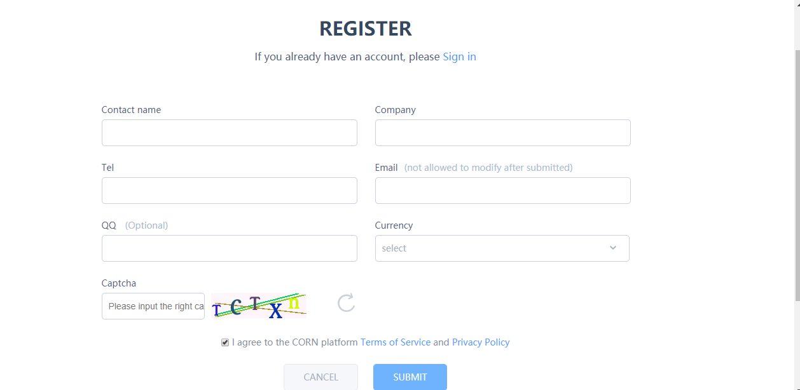
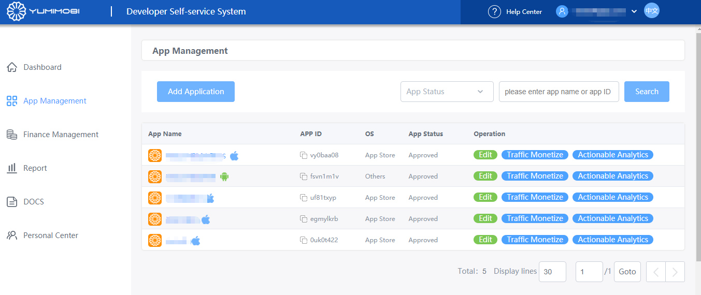
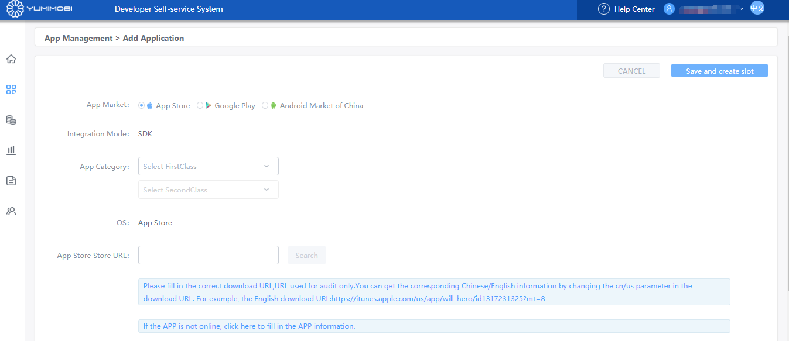
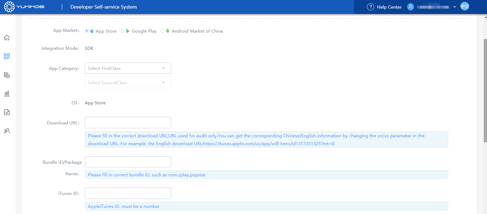
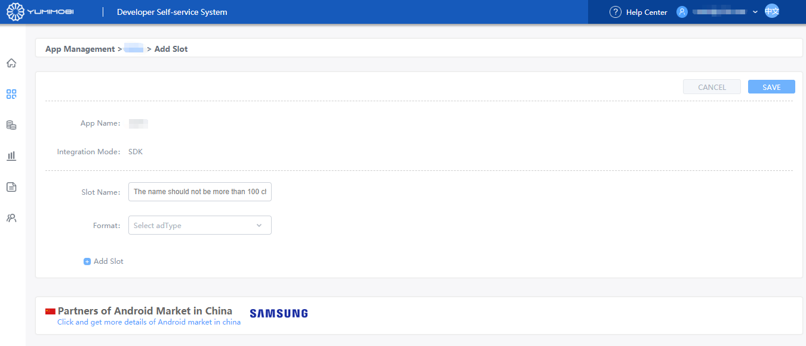
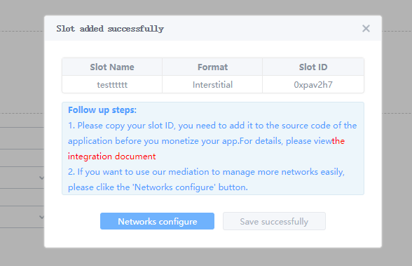
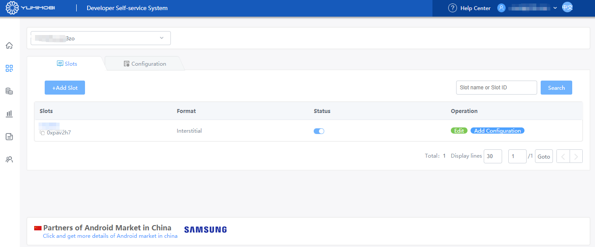

# YUMIMOBI-Ironsource tag Integration Guide

## 前言

* The ironSource Server Side Networks module ru only and is available for ironSource SDK version 6.4.17+ 
* The ironSource Server Side Network feature needs to be applied separately, please contact ironSource directly

## 1. Apply for a developer account on the YUMIMOBI platform

### 1.1 Enter the [YUMIMOBI](https://ssp.yumimobi.com/#/register/) platform, fill in the developer basic information and submit, wait for the account to review

## 2. Apply for  Ad slot（ placement） ID on YUMIMOBI platform

### 2.1  Click *Add Application* button in [App Management ](https://ssp.yumimobi.com/#/app/appList/) page

### 2.2 Fill in the relevant information and click the "Save" button to enter the Create Add Slot page.

a. If your APP is launched in Google Play or APP STORE , you can fill in the app link address to get app information.

b. If you are not online on Google Play or APP STORE, or posted on a non-Google Play channel, you will need to manually fill in the app information.

### 2.3 After the app is created successfully, click Save or on the App Management page, click the app name to enter the [Slots Page](https://ssp.yumimobi.com/#/slot/slotList/0vwnp8zo/8995) and click Add Slot, create ad Slot ID

### 2.4 Fill in the information about the add Slot , click the "Save successfully" button, return to the ad Slots page, and get the Slot ID.

## 3. Add YUMIMOBI to the new tag on the IronSource platform 

### 3.1. ironSource Server-Side Networks Setup ，as below

* ironSource of Integration Guid[ Server-Side Networks Setup ](https://developers.ironsrc.com/ironsource-mobile/server-side-networks-setup/#step-1)
  
### 3.2. YUMIMOBI Generates Tag URL 

#### 3.2.1. YUMIMOBI URL link：

* YUMIMOBI URL link：

https://bid.adx.yumimobi.com/s/ironsource?slot_id=[YUMI_SLOT_ID]&ip=[IP]&ua=[UA]&ifa=[IFA]&gdpr_consent=[GDPR_CONSENT]&os=[OS]&device_model=[DEVICE_MODEL]&ad_height=[HEIGHT]&ad_width=[WIDTH]&app_bundle_id=[APP_BUNDLE_ID]&app_store_url=[APP_STORE_URL]&app_name=[APP_NAME]&app_category=[APP_CATEGORY]&lat=[LAT]&lat_s=[LAT_STRING]&osv=[OS_VERSION]&api_level=[API_Level]&timestamp=[TIME_STAMP]&carrier=[CARRIER]&network=[NETWORK]&sdk_version=[SDK_VERSION]&random=[RANDOM]

#### 3.2.2. YUMIMOBI generates Tag URL mode：

* Replace the [YUMI_SLOT_ID] macro parameter in the YUMIMOBI URL with the ad slot ID in the YUMMOBI  [Slots Page](https://ssp.yumimobi.com/#/slot/slotList/0vwnp8zo/8995)

Example: Interstitial slot ID: onkkeg5i, generated Tag URL is:

https://bid.adx.yumimobi.com/s/ironsource?slot_id=[onkkeg5i]&ip=[IP]&ua=[UA]&ifa=[IFA]&gdpr_consent=[GDPR_CONSENT]&os=[OS]&device_model=[DEVICE_MODEL]&ad_height=[HEIGHT]&ad_width=[WIDTH]&app_bundle_id=[APP_BUNDLE_ID]&app_store_url=[APP_STORE_URL]&app_name=[APP_NAME]&app_category=[APP_CATEGORY]&lat=[LAT]&lat_s=[LAT_STRING]&osv=[OS_VERSION]&api_level=[API_Level]&timestamp=[TIME_STAMP]&carrier=[CARRIER]&network=[NETWORK]&sdk_version=[SDK_VERSION]&random=[RANDOM]

#### 3.2.3. Fill the YUMIMOBI Tag URL into the ironSource dashboard

* Fill in the YUMIMOBI Tag URL generated in 3.2.2 into the ironSource Tag URL field.
* Other parameters of the [ironSource platfor](https://platform.ironsrc.com/partners/monetize/mediation/serverSideSetup) , according to the actual filling

#### 3.2.4. Confirm that the YUMIMOBI configuration is successful

*  Find the app that configures the tag in the ironSource dashboard, and make sure the Status is Active.

## 4. TEST ID

Note: You are available to use the following ID when testing(not charge). Please switch to the ID you applied in production mode.

|OS| Ad_Type |YUMIMOBI_Slot_ID|Tag URL|
| ---- | -------- | -------- | ------ | 
|iOS | Interstitial | onkkeg5i  |https://bid.adx.yumimobi.com/s/ironsource?slot_id=[onkkeg5i]&ip=[IP]&ua=[UA]&ifa=[IFA]&gdpr_consent=[GDPR_CONSENT]&os=[OS]&device_model=[DEVICE_MODEL]&ad_height=[HEIGHT]&ad_width=[WIDTH]&app_bundle_id=[APP_BUNDLE_ID]&app_store_url=[APP_STORE_URL]&app_name=[APP_NAME]&app_category=[APP_CATEGORY]&lat=[LAT]&lat_s=[LAT_STRING]&osv=[OS_VERSION]&api_level=[API_Level]&timestamp=[TIME_STAMP]&carrier=[CARRIER]&network=[NETWORK]&sdk_version=[SDK_VERSION]&random=[RANDOM]|| 
|iOS| Rewarded Video| 5xmpgti4  |https://bid.adx.yumimobi.com/s/ironsource?slot_id=[Y5xmpgti4]&ip=[IP]&ua=[UA]&ifa=[IFA]&gdpr_consent=[GDPR_CONSENT]&os=[OS]&device_model=[DEVICE_MODEL]&ad_height=[HEIGHT]&ad_width=[WIDTH]&app_bundle_id=[APP_BUNDLE_ID]&app_store_url=[APP_STORE_URL]&app_name=[APP_NAME]&app_category=[APP_CATEGORY]&lat=[LAT]&lat_s=[LAT_STRING]&osv=[OS_VERSION]&api_level=[API_Level]&timestamp=[TIME_STAMP]&carrier=[CARRIER]&network=[NETWORK]&sdk_version=[SDK_VERSION]&random=[RANDOM]| 
|Android|Interstitial  | 56ubk22h  |https://bid.adx.yumimobi.com/s/ironsource?slot_id=[56ubk22h]&ip=[IP]&ua=[UA]&ifa=[IFA]&gdpr_consent=[GDPR_CONSENT]&os=[OS]&device_model=[DEVICE_MODEL]&ad_height=[HEIGHT]&ad_width=[WIDTH]&app_bundle_id=[APP_BUNDLE_ID]&app_store_url=[APP_STORE_URL]&app_name=[APP_NAME]&app_category=[APP_CATEGORY]&lat=[LAT]&lat_s=[LAT_STRING]&osv=[OS_VERSION]&api_level=[API_Level]&timestamp=[TIME_STAMP]&carrier=[CARRIER]&network=[NETWORK]&sdk_version=[SDK_VERSION]&random=[RANDOM]| 
|Android| Rewarded Video | ew9hyvl4  |https://bid.adx.yumimobi.com/s/ironsource?slot_id=[ew9hyvl4]&ip=[IP]&ua=[UA]&ifa=[IFA]&gdpr_consent=[GDPR_CONSENT]&os=[OS]&device_model=[DEVICE_MODEL]&ad_height=[HEIGHT]&ad_width=[WIDTH]&app_bundle_id=[APP_BUNDLE_ID]&app_store_url=[APP_STORE_URL]&app_name=[APP_NAME]&app_category=[APP_CATEGORY]&lat=[LAT]&lat_s=[LAT_STRING]&osv=[OS_VERSION]&api_level=[API_Level]&timestamp=[TIME_STAMP]&carrier=[CARRIER]&network=[NETWORK]&sdk_version=[SDK_VERSION]&random=[RANDOM]

