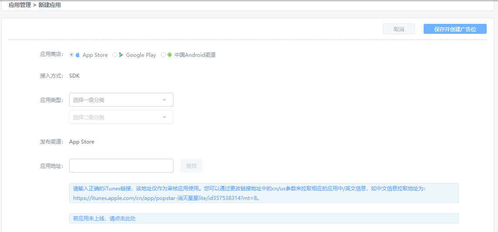

# YUMIMOBI-Ironsource tag 接入文档

* ironSource Server Side Network 仅适用于ironSource服务器端网络模块，适用于ironSource SDK版本6.4.17+
* ironSource Server Side Network 功能需单独申请，请直接联系 ironSource 商务

## 1. 在 YUMIMOBI 平台申请开发者账号

### 1.1. 进入[YUMIMOBI](https://ssp.yumimobi.com/#/register/)平台，填写开发者基础信息并提交，等待账号审核

## 2. 审核通过后，在 YUMIMOBI 平台申请广告位 ID

### 2.1. 开发者账号审核通过后，进入[应用管理](https://ssp.yumimobi.com/#/app/appList/)页面，点击“新建应用”按钮

### 2.2. 填写相关信息，点击“保存”按钮，进入创建广告位页面

a. 若您的应用已上线，且为 Google Play 或者 APP STORE 渠道的应用，可直接填入应用链接地址获取应用信息

b. 若您未在Google Play或者APP STORE上线，或发布在非Google Play渠道，您需手动填写应用信息

### 2.3. 应用创建成功后，点击保存或者在应用列表页，点击应用名称进入[广告位列表页](https://ssp.yumimobi.com/#/slot/slotList/41gqxns9/8994)点击新建广告位，创建广告位 ID

### 2.4. 填写广告位相关信息，点击“创建成功”按钮，返回广告位管理列表页，在广告位管理列表页，获取广告位的 ID

## 3. 添加 YUMIMOBI tag 到 ironSource 平台

### 3.1. ironSource Server-Side Networks Setup 操作步骤

* ironSource 操作请参考 [ Server-Side Networks Setup 操作文档](https://developers.ironsrc.com/ironsource-mobile/server-side-networks-setup/#step-1)
  
### 3.2. YUMIMOBI 生成 Tag URL 方法 

#### 3.2.1. YUMIMOBI 初始 URL 链接：

* 以下为YUMIMOBI 初始 URL 链接地址：

https://bid.adx.yumimobi.com/s/ironsource?slot_id=[YUMI_SLOT_ID]&ip=[IP]&ua=[UA]&ifa=[IFA]&gdpr_consent=[GDPR_CONSENT]&os=[OS]&device_model=[DEVICE_MODEL]&ad_height=[HEIGHT]&ad_width=[WIDTH]&app_bundle_id=[APP_BUNDLE_ID]&app_store_url=[APP_STORE_URL]&app_name=[APP_NAME]&app_category=[APP_CATEGORY]&lat=[LAT]&lat_s=[LAT_STRING]&osv=[OS_VERSION]&api_level=[API_Level]&timestamp=[TIME_STAMP]&carrier=[CARRIER]&network=[NETWORK]&sdk_version=[SDK_VERSION]&random=[RANDOM]

#### 3.2.2. YUMIMOBI 生成 Tag URL 方法：

* 将 YUMIMOBI 初始 URL 中 [YUMI_SLOT_ID] 宏参数替换为您在YUMMOBI后台[广告位列表页](https://ssp.yumimobi.com/#/slot/slotList/41gqxns9/8994)申请的广告位ID

示例：例如Interstitial广告位ID： onkkeg5i，生成的Tag URL为：
https://bid.adx.yumimobi.com/s/ironsource?slot_id=[onkkeg5i]&ip=[IP]&ua=[UA]&ifa=[IFA]&gdpr_consent=[GDPR_CONSENT]&os=[OS]&device_model=[DEVICE_MODEL]&ad_height=[HEIGHT]&ad_width=[WIDTH]&app_bundle_id=[APP_BUNDLE_ID]&app_store_url=[APP_STORE_URL]&app_name=[APP_NAME]&app_category=[APP_CATEGORY]&lat=[LAT]&lat_s=[LAT_STRING]&osv=[OS_VERSION]&api_level=[API_Level]&timestamp=[TIME_STAMP]&carrier=[CARRIER]&network=[NETWORK]&sdk_version=[SDK_VERSION]&random=[RANDOM]

#### 3.2.3. 将 YUMIMOBI Tag URL 填写到 ironSource 后台

* 将 3.2.2 中生成的 YUMIMOBI Tag URL 填写到 ironSource Tag URL字段下

* [ironSource 平台](https://platform.ironsrc.com/partners/monetize/mediation/serverSideSetup)其他参数，根据实际填写即可

#### 3.2.4. 确认配置成功

* 在ironSource 后台找到配置tag的应用，确保 Status 状态为开启（Active）

## 4. 测试ID

注：您在测试中可使用如下 id 进行测试，测试 id 不会产生收益，应用上线时请使用您申请的正式id。

|系统| 广告形式  | YUMIMOBI广告位ID|Tag URL|
| ---- | -------- | -------- | ------ | 
|iOS |Interstitial  | onkkeg5i  |https://bid.adx.yumimobi.com/s/ironsource?slot_id=[onkkeg5i]&ip=[IP]&ua=[UA]&ifa=[IFA]&gdpr_consent=[GDPR_CONSENT]&os=[OS]&device_model=[DEVICE_MODEL]&ad_height=[HEIGHT]&ad_width=[WIDTH]&app_bundle_id=[APP_BUNDLE_ID]&app_store_url=[APP_STORE_URL]&app_name=[APP_NAME]&app_category=[APP_CATEGORY]&lat=[LAT]&lat_s=[LAT_STRING]&osv=[OS_VERSION]&api_level=[API_Level]&timestamp=[TIME_STAMP]&carrier=[CARRIER]&network=[NETWORK]&sdk_version=[SDK_VERSION]&random=[RANDOM]|| 
|iOS|Rewarded Video   | 5xmpgti4  |https://bid.adx.yumimobi.com/s/ironsource?slot_id=[Y5xmpgti4]&ip=[IP]&ua=[UA]&ifa=[IFA]&gdpr_consent=[GDPR_CONSENT]&os=[OS]&device_model=[DEVICE_MODEL]&ad_height=[HEIGHT]&ad_width=[WIDTH]&app_bundle_id=[APP_BUNDLE_ID]&app_store_url=[APP_STORE_URL]&app_name=[APP_NAME]&app_category=[APP_CATEGORY]&lat=[LAT]&lat_s=[LAT_STRING]&osv=[OS_VERSION]&api_level=[API_Level]&timestamp=[TIME_STAMP]&carrier=[CARRIER]&network=[NETWORK]&sdk_version=[SDK_VERSION]&random=[RANDOM]| 
|Android|Interstitial  | 56ubk22h  |https://bid.adx.yumimobi.com/s/ironsource?slot_id=[56ubk22h]&ip=[IP]&ua=[UA]&ifa=[IFA]&gdpr_consent=[GDPR_CONSENT]&os=[OS]&device_model=[DEVICE_MODEL]&ad_height=[HEIGHT]&ad_width=[WIDTH]&app_bundle_id=[APP_BUNDLE_ID]&app_store_url=[APP_STORE_URL]&app_name=[APP_NAME]&app_category=[APP_CATEGORY]&lat=[LAT]&lat_s=[LAT_STRING]&osv=[OS_VERSION]&api_level=[API_Level]&timestamp=[TIME_STAMP]&carrier=[CARRIER]&network=[NETWORK]&sdk_version=[SDK_VERSION]&random=[RANDOM]| 
|Android| Rewarded Video | ew9hyvl4  |https://bid.adx.yumimobi.com/s/ironsource?slot_id=[ew9hyvl4]&ip=[IP]&ua=[UA]&ifa=[IFA]&gdpr_consent=[GDPR_CONSENT]&os=[OS]&device_model=[DEVICE_MODEL]&ad_height=[HEIGHT]&ad_width=[WIDTH]&app_bundle_id=[APP_BUNDLE_ID]&app_store_url=[APP_STORE_URL]&app_name=[APP_NAME]&app_category=[APP_CATEGORY]&lat=[LAT]&lat_s=[LAT_STRING]&osv=[OS_VERSION]&api_level=[API_Level]&timestamp=[TIME_STAMP]&carrier=[CARRIER]&network=[NETWORK]&sdk_version=[SDK_VERSION]&random=[RANDOM]

